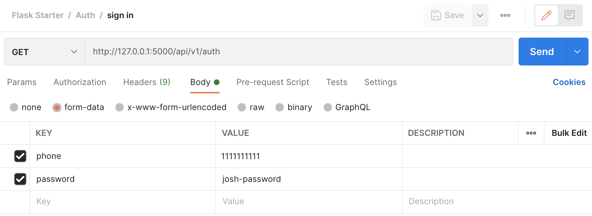

# Flask starter
Simple Python Flask backend server starter project.

[](https://opensource.org/licenses/Apache-2.0)
[](https://badge.fury.io/gh/tterb%2FHyde)

###### _Note: Instructions below are MacOS-specific_

## Setup

Setup the project by installing the requirements and running a [PostgreSQL](https://www.postgresql.org/) database locally.

1. Install requirements

    ```
    pip install -r requirements.txt
    ```

2. Run a PostgreSQL database

    * Download and install [postgres.app](https://postgresapp.com/)

    * Open Postgres and enter `localhost` as the host when prompted

    * Click `Start` to run Postgres

        

    * Execute SQL command to create a test database

        ```
        postgres=# CREATE DATABASE flask_starter;
        ```

## Testing

Test the project by running the [Flask](https://flask.palletsprojects.com/en/2.0.x/) app locally and querying the API using [Postman](https://www.postman.com/).

1. Add an `.env` file to the root project directory

    ```
    AUTH_TOKEN_LIFESPAN_SEC=180
    DATABASE_URL=postgresql:///flask_starter
    FLASK_ENV=development
    SECRET_KEY=add-your-secret-key-here
    SQLALCHEMY_ECHO=True
    SQLALCHEMY_TRACK_MODIFICATIONS=True
    ```

2. Run the Flask app locally

    ```
    python app.py
    ```
3. Query the API using Postman

    * Download [Postman](https://www.postman.com/downloads/)

    * Import [this](docs/flask_starter.postman_collection.json) test collection

    * Executing Postman requests to the Flask app running locally

        * Include request parameters under `Body` (form data)

            

        * Include the authentication token under `Headers`

            

## Deployment

Deploy the project on [Heroku](https://heroku.com) for free.

1. [Create](https://dashboard.heroku.com/new-app) a new Heroku app

    * Add all constants from `.env` to your app, except `DATABASE_URL`

        * `Settings` -> `Config Vars`

2. Connect the Heroku app to a [GitHub](https://github.com/) repo containing this codebase

    

    * Enable `Automatic Deploys` from branch `main`

3. Add the [Heroku Postgres](https://elements.heroku.com/addons/heroku-postgresql) add-on

    

    * This will add the `DATABASE_URL` constant to your Heroku app

4. Verify your app is running by visiting the API root

    ```
    open https://<heroku_project_name>.herokuapp.com/api/v1
    ```

    * You can execute commands in Postman by changing the URL of requests from `127.0.0.1:5000` to `<heroku_project_name>.herokuapp.com`.
